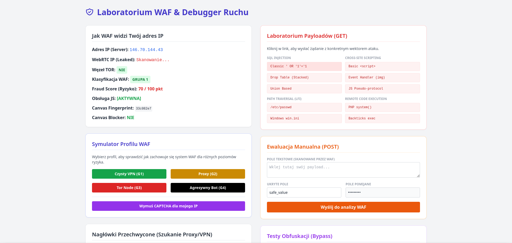
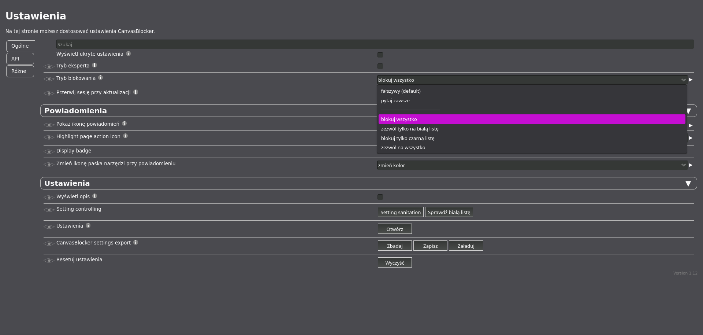
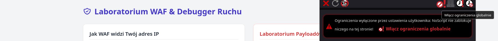
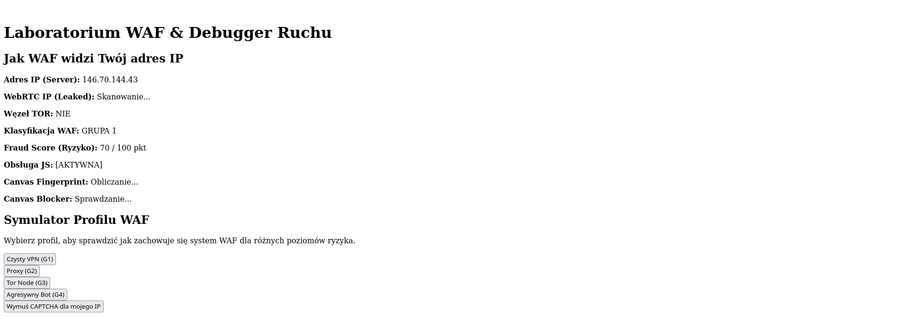

# Basic Audits and OpSec Tutorial

A comprehensive tutorial about **operational security (OpSec)** and **website security audits**.

## 📋 Overview

This repository contains detailed guides and practical resources for:
- Conducting security audits on websites
- Understanding and implementing operational security best practices
- Setting up vulnerable lab environments for learning and testing
- Security analysis and vulnerability assessment

## 📚 Available Resources

### Documentation

1. **[OpSec & Audits - English](./opsec&audits-github-eng.md)**
   - Complete guide to operational security and website audits in English
   - Best practices and security assessment techniques
   - Comprehensive coverage of OpSec principles

2. **[OpSec & Audits - Polish](./opsecs&audits-github-pl.md)**
   - Complete guide to operational security and website audits in Polish
   - Polish language version of the comprehensive tutorial
   - Security assessment methodologies and best practices

### Lab Environment

- **[lamp_vulnerable_lab_v2.zip](./lamp_vulnerable_lab_v2.zip)**
  - Vulnerable LAMP stack lab environment for hands-on learning
  - Use this to practice audit techniques in a safe, controlled environment
  - Perfect for testing and understanding security vulnerabilities

### Visual Guides

The repository includes visual documentation of the audit and security processes:

## 🎯 What You'll Learn

- **Operational Security (OpSec)**: Protecting sensitive information and maintaining security practices
- **Website Audits**: Systematic approach to identifying security vulnerabilities
- **Vulnerability Assessment**: Techniques for testing and evaluating web application security
- **Security Best Practices**: Implementing robust security measures

## 🚀 Getting Started

1. Start by reviewing the documentation in your preferred language:
   - English: [opsec&audits-github-eng.md](./opsec&audits-github-eng.md)
   - Polish: [opsecs&audits-github-pl.md](./opsecs&audits-github-pl.md)

2. Download and extract the vulnerable lab environment:
   - Extract `lamp_vulnerable_lab_v2.zip` to set up your practice environment

3. Follow the step-by-step guides with visual references to understand the audit process

## 📖 How to Use This Repository

- **Read the Guides**: Start with the markdown documentation files
- **View Examples**: Check the included screenshots for visual learning
- **Practice Safely**: Use the vulnerable lab environment to practice your skills
- **Reference**: Use this as a resource guide for conducting your own security audits

## ⚠️ Important Notes

- The **vulnerable lab** is for **educational and authorized testing purposes only**
- Always obtain proper authorization before conducting security audits on any system
- Practice responsible disclosure when discovering vulnerabilities
- Use this knowledge ethically and legally

## 📝 License

This tutorial is provided as an educational resource.

## 👤 Author

Created by [hoxedzik666](https://github.com/hoxedzik666)

---

**Last Updated**: June 4, 2026

For questions or contributions, feel free to open an issue or pull request.
